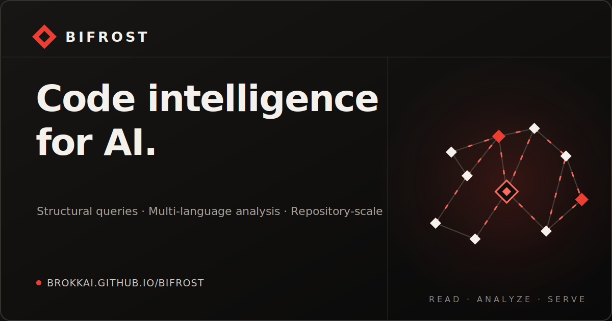
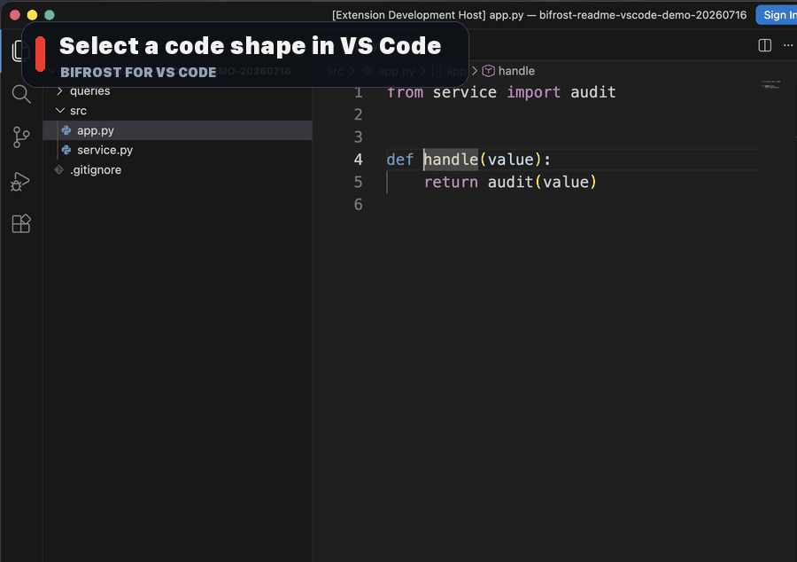
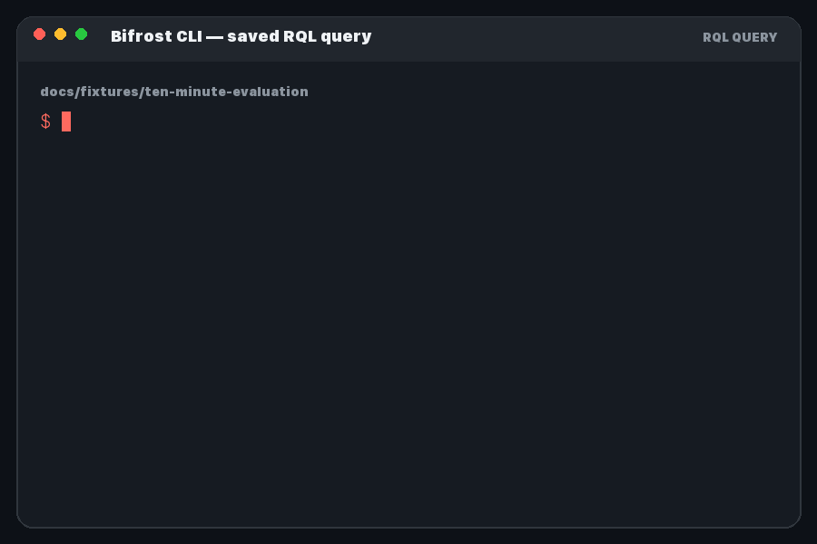

<h1 align="center">Bifrost</h1>

<p align="center">
  <a href="https://bifrost.brokk.ai/">
    
  </a>
</p>

<p align="center">
  <a href="https://github.com/BrokkAi/bifrost/actions/workflows/ci.yml"></a>
  <a href="https://github.com/BrokkAi/bifrost/releases/latest"></a>
  <a href="https://crates.io/crates/brokk-bifrost"></a>
  <a href="https://pypi.org/project/brokk-bifrost-searchtools/"></a>
  <a href="LICENSE.md"></a>
</p>

<p align="center">
  <a href="#run-your-first-query">Quickstart</a> ·
  <a href="https://bifrost.brokk.ai/">Documentation</a> ·
  <a href="https://bifrost.brokk.ai/evaluate-bifrost/">Ten-minute evaluation</a> ·
  <a href="https://discord.gg/geYkWUeH">Discord</a>
</p>

## Why Bifrost?

`bifrost` is Brokk's Rust-based static analysis toolbox for AI coding harnesses,
editors, and large repositories.

Bifrost gives every supported language a shared intermediate representation, so
the same structural query and navigation workflows work across a mixed-language
repository instead of stopping at language boundaries.

- **One multi-language IR.** Parse unbuilt or partially broken workspaces and
  normalize their source structure for cross-language analysis.
- **A real query language.** Use JSON CodeQuery or the Rune Query Language
  (RQL) to find language-neutral code shapes and traverse indexed declarations,
  references, calls, imports, and type relationships.
- **Built for agents and editors.** Expose structured MCP tools to coding
  agents, LSP features to editors, and the same analyzer through the CLI,
  Python, and Rust.
- **Designed for active repositories.** Snapshot isolation, incremental updates,
  content-based caching, and git/worktree awareness keep analysis responsive as
  a repository changes.

See [Choose Bifrost](https://bifrost.brokk.ai/choose-bifrost/) for the
right interface for your workflow, and the [Language and Analysis
Capabilities](https://bifrost.brokk.ai/capabilities/) matrix for
language-by-language support, precision tiers, and current analysis boundaries.

## Run Your First Query

Install the released CLI, clone the small verified evaluation fixture, and run
its saved RQL query:

```bash
cargo install brokk-bifrost --locked
git clone --depth 1 https://github.com/BrokkAi/bifrost.git
cd bifrost/docs/fixtures/ten-minute-evaluation
bifrost --root . --query-file queries/find-audit.rql
```

The result identifies the normalized Python call and its exact source location:

```json
{
  "isError": false,
  "structuredContent": {
    "results": [
      {
        "enclosing_symbol": "src.app.handle",
        "end_line": 5,
        "kind": "call",
        "language": "python",
        "path": "src/app.py",
        "result_type": "structural_match",
        "start_line": 5,
        "text": "audit(value)"
      }
    ],
    "truncated": false
  }
}
```

Continue with the [ten-minute
evaluation](https://bifrost.brokk.ai/evaluate-bifrost/) to run the same
query through the CLI, an MCP-connected coding agent, and VS Code.

## See Bifrost in Action

### Turn Source into a Query in VS Code

<p align="center">
  <a href="https://bifrost.brokk.ai/rune-ir/">
    
  </a>
</p>

Select a source construct and run **Bifrost: Show Rune IR** to inspect its
language-neutral `.rune` form and get a conservative starter RQL query. Run that
query from the editor, browse typed results grouped by file, and jump to the
exact source range. The extension also provides definitions, references, hover,
rename, symbols, hierarchy, diagnostics, completion, and other LSP features.

### Use the Same Analyzer from the CLI

<p align="center">
  <a href="https://bifrost.brokk.ai/cli/">
    
  </a>
</p>

Run saved RQL or JSON queries directly, or call the same named tools exposed over
MCP for shell scripts and reproducible analysis workflows.

## Language Coverage

Bifrost includes analyzers for C, C++, C#, Go, Java, JavaScript, PHP, Python,
Ruby, Rust, Scala, and TypeScript. See the [capability
matrix](https://bifrost.brokk.ai/capabilities/) for the supported
analysis and precision boundaries in each language.

## Documentation

The public documentation site lives in [`docs/`](docs/) and is published at
[bifrost.brokk.ai](https://bifrost.brokk.ai/).

Useful starting points:

- [Choose the right Bifrost interface](docs/src/content/docs/choose-bifrost.md)
- [Third-party notices](docs/src/content/docs/third-party-notices.md)
- [Install Bifrost](docs/src/content/docs/install.md)
- [Evaluate Bifrost in ten minutes](docs/src/content/docs/evaluate-bifrost.md)
- [MCP server and toolsets](docs/src/content/docs/mcp.md)
- [LSP server](docs/src/content/docs/lsp.md)
- [CLI usage](docs/src/content/docs/cli.md)
- [Code querying](docs/src/content/docs/code-querying.md)

Run the docs site locally with:

```bash
cd docs
npm install
npm run dev
```

GitHub Pages publication is handled by `.github/workflows/docs.yml`. Release tag
builds publish both the latest docs site and a versioned snapshot under
`versions/<tag>/`.

## License and Commercial Use

Bifrost is licensed under `LGPL-3.0-or-later` and may be used in research,
internal systems, hosted services, and commercial products. The integration and
distribution boundary determines your obligations. Read [License and Use
Cases](https://bifrost.brokk.ai/license-use-cases/) for practical
subprocess, linked-library, hosted-service, and redistribution examples. That
guide is an orientation, not legal advice; the [license text](LICENSE.md)
controls.

## Contributing

For local development, test commands, repository-local Python workflow, and
release tagging, see [CONTRIBUTING.md](CONTRIBUTING.md).
