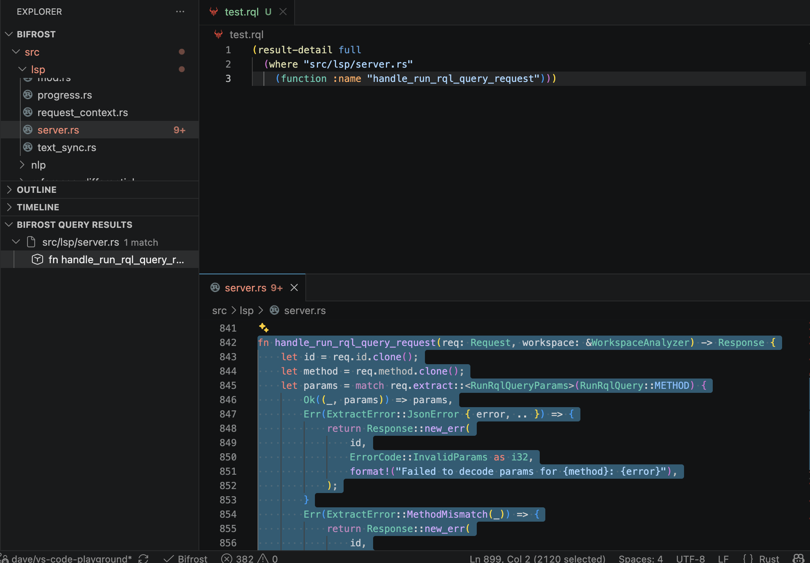

The Bifrost VS Code extension recognizes `.rql` files as **Bifrost RQL**. RQL,
the [Rune Query Language](/rune-query-language/), is Bifrost's experimental
S-expression frontend for structural `query_code` searches.

With the Bifrost language server running and indexed, use the Play button in
an RQL editor title to execute the current document. Unsaved edits are sent to
the active LSP session, so you can refine a query without first saving it.

For `(explain QUERY)` and `(profile QUERY)`, the extension shows the report in the Bifrost output channel. Profile output includes the complete versioned JSON telemetry, while its nested ordinary results remain available in the grouped query-results tree. Explain mode is planning-only and therefore does not show a misleading “no results” notification. See [Explain and Profile CodeQuery](/code-query-explain-profile/).

Use VS Code's **Format Document** command to format `.rql` and saved `.rune`
files through the Bifrost language server. Bracketed forms remain on one line
through 120 columns. Longer forms place their entries on indented lines and
keep `:property value` pairs together when possible. The formatter preserves
comments and does not edit incomplete S-expressions.

## RQL Policy Documents

The extension recognizes `.rqlp` as the distinct **Bifrost RQL Policy**
language. Policy and endpoint buffers receive debounced source validation,
schema-resolution hover, optional-version completion, conservative policy
highlighting, and 100-column formatting. Nested query syntax receives RQL
highlighting only inside `(rql ...)`; an `(rql-file ...)` reference is validated
and resolved later by a workspace-backed policy load.

Policy validation uses the current unsaved source, but it deliberately does not
load endpoint directories, catalogs, or referenced query files. Formatting
preserves comments and omitted `:schema-version` fields and returns no edit for
an incomplete S-expression.

An `.rqlp` buffer is not an RQL query document. It never enables the Play
action, cannot publish findings into **Bifrost Query Results**, and cannot be
passed to `--query-file`. Execute a saved `(policy ...)` root with
`bifrost --policy-file`; an `(endpoint ...)` is a diagnostic-neutral dependency,
not an executable root. See [Static-Analysis
Policies](/static-analysis-policies/) for the complete authoring and reporting
contract.

This Play action is a VS Code language-server feature. It does not start an MCP server, expose `query_code` to an agent, or prove that an agent can run RQL. For agent access, configure a query-capable MCP toolset and use a saved workspace `.rql` file through `query_file`; MCP does not accept unsaved editor text or raw inline RQL. See [MCP query and RQL availability](/mcp/#query-and-rql-availability).

```lisp
(result-detail full
  (where "src/lsp/server.rs"
    (function :name "handle_run_rql_query_request")))
```

The **Bifrost Query Results** Explorer view groups tagged structural-match,
declaration, and file results by path. Select a structural match or declaration
to open its file and highlight the source range; selecting a file result opens
the file at its first line. Pipeline wrappers such as `enclosing-decl` and
`file-of` therefore remain navigable from the same view.



## Query Scope

The query runs across every root indexed by the active Bifrost LSP session:

- all VS Code workspace folders by default; or
- the directories selected with `bifrost.roots`.

The `.rql` file itself may live outside the workspace. Only the code searched
by the query is limited to the active indexed roots.

The Play action does not start Bifrost or wait for indexing. Start or restart
the language server first, then run the query once it is ready. Use
`bifrost.serverPath` to point the extension at a local Bifrost build during
extension development.

For the RQL syntax and REPL workflow, see [Rune Query Language](/rune-query-language/).
