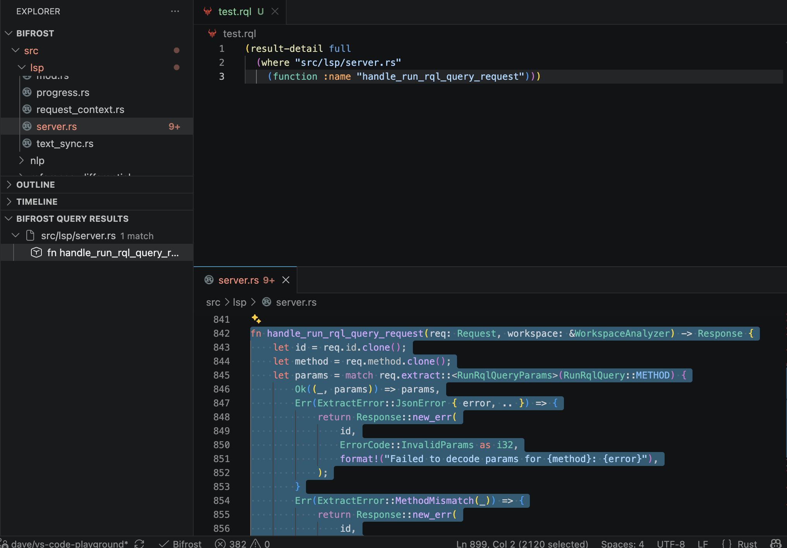

The Bifrost VS Code extension recognizes `.rql` files as **Bifrost RQL**. RQL,
the [Rune Query Language](/rune-query-language/), is Bifrost's experimental
S-expression frontend for structural `query_code` searches.

With the Bifrost language server running and indexed, use the Play button in
an RQL editor title to execute the current document. Unsaved edits are sent to
the active LSP session, so you can refine a query without first saving it.

For `(explain QUERY)` and `(profile QUERY)`, the extension shows the report in the Bifrost output channel. Profile output includes the complete versioned JSON telemetry, while its nested ordinary results remain available in the grouped query-results tree. Explain mode is planning-only and therefore does not show a misleading “no results” notification. See [Explain and Profile CodeQuery](/code-query-explain-profile/).

Use VS Code's **Format Document** command to format `.rql` and saved `.rune`
files through the Bifrost language server. Bracketed forms remain on one line
through 120 columns. Longer forms place their entries on indented lines and
keep `:property value` pairs together when possible. The formatter preserves
comments and does not edit incomplete S-expressions.

## RQL Policy Documents

The extension recognizes `.rqlp` as the distinct **Bifrost RQL Policy**
language. Policy and endpoint buffers receive debounced source validation,
schema-resolution hover, optional-version completion, conservative policy
highlighting, and 100-column formatting. Nested query syntax receives RQL
highlighting only inside `(rql ...)`; an `(rql-file ...)` reference is validated
and resolved later by a workspace-backed policy load.

Policy validation uses the current unsaved source, but it deliberately does not
load endpoint directories, catalogs, or referenced query files. Formatting
preserves comments and omitted `:schema-version` fields and returns no edit for
an incomplete S-expression.

An `.rqlp` buffer is not an ordinary RQL query document. Its editor-title Play
button invokes **Run RQL Policy**, sends the current unsaved policy root to the
language server, and resolves saved `rql-file`, endpoint, and directory
dependencies beneath that policy's workspace root. An `(endpoint ...)` root
remains diagnostic-neutral and non-executable. Policy buffers cannot publish
findings into **Bifrost Query Results** and cannot be passed to `--query-file`.

The extension supplies today's UTC evaluation date and uses the conventional
`.bifrost/suppressions.json` project file. Active findings appear under
**Bifrost Policy Results**. Applied findings are hidden from each policy's
active list but remain under **Suppression audit**, which also shows stale,
expired, policy-hash-drifted, unproven, and omitted-result decisions. Editing
the policy or workspace while a run is in flight marks retained results stale;
starting a new run cancels the earlier request. Use the CLI with an explicit
`--evaluation-date` and optional `--suppressions-file` when the date or file
must be pinned independently of the editor.

These Play actions are VS Code language-server features. They do not start an
MCP server or prove that an agent can run a query or policy. For agent query
access, configure a query-capable MCP toolset and use a saved workspace `.rql`
file through `query_file`; MCP does not accept unsaved editor text or raw
inline RQL. For agent policy access, call the distinct `run_policy` MCP tool
with explicit workspace `.rqlp` paths and an evaluation date. See [MCP query
and RQL availability](/mcp/#query-and-rql-availability).

```lisp
(result-detail full
  (where "src/lsp/server.rs"
    (function :name "handle_run_rql_query_request")))
```

The **Bifrost Query Results** Explorer view groups every tagged result by path,
including structural matches, declarations, procedures, program points,
control edges, typestate findings/witnesses, occurrences, lexical scopes,
bindings, resolution candidates, reference edges, and files. Select a source-backed
result to open its file and highlight its range; control edges show both
endpoint IDs and ranges. Typestate findings show certainty, protocol identity,
proof/completeness, and witness counts without inventing severity. Expand a
typestate witness to navigate each ordered source-backed step; tooltips retain
evidence and truncation/omission metadata. Selecting a file result opens the
file at its first line. Pipeline wrappers such as `enclosing-decl`,
`cfg-successor-edges`, `typestate`, `witness`, `occurrences-in`,
`binding-of`, `candidates-of`, `edges-of`, `edges-from`, and `file-of`
therefore remain navigable from the same view. Occurrence rows show their
class, role, and namespace; their tooltips show the raw and decoded spellings
and what the row's target resolved to. Lexical scope rows show their kind and
their parent scope, and the one scope per file with no AST node is labelled as
the synthesized whole-file scope. Binding rows show their kind, hoisting class,
declaring scope and the byte interval over which they are in effect. Resolution
candidate rows show the precedence tier, the outcome with any typed rejection
reason, and the boundary status; a candidate whose recording seam could not name
a tier is shown as `unattributed` rather than as the weakest tier, and a tooltip
over a `selection_only` trace says so, because an absent rejection row there
says nothing. Reference edge rows show which producer derived them -- `forward`
from the resolver, `inverse` from the usage index -- alongside the reference
kind, usage kind and site class; their tooltips state that an `unknown` owner
relation is inconclusive rather than external, and that a `declaration_site`
row is editor-visible navigation rather than a runtime usage.

The language server itself does not accept protocol or binding files over this
private request. Results/profile typestate queries require the embedding host
to pre-register the named protocol against the current workspace; otherwise
the output shows the typed unresolved-reference diagnostic. Explain mode can
still display the planned typestate operator without registration or solver
work.



## Query Scope

The query runs across every root indexed by the active Bifrost LSP session:

- all VS Code workspace folders by default; or
- the directories selected with `bifrost.roots`.

The `.rql` file itself may live outside the workspace. Only the code searched
by the query is limited to the active indexed roots.

The Play action does not start Bifrost or wait for indexing. Start or restart
the language server first, then run the query once it is ready. Use
`bifrost.serverPath` to point the extension at a local Bifrost build during
extension development.

For the RQL syntax and REPL workflow, see [Rune Query Language](/rune-query-language/).
